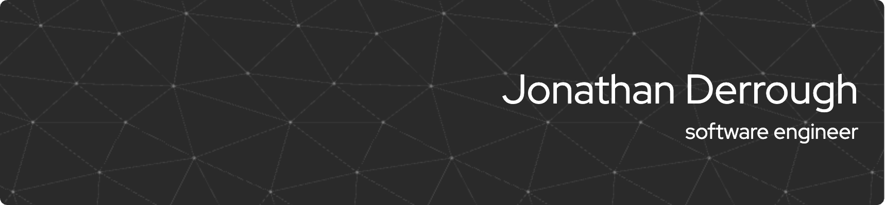

# Hi, I'm Jonathan 🐙

Curious and passionate, always eager to learn and grow, my craft is creating groundbreaking solutions that integrate best practices and state-of-the-art technologies, focusing on quality through automation of testing and delivery.

## Stacks 🥞

### Web 🕸️

### Mobile 📱 & Video games 👾

